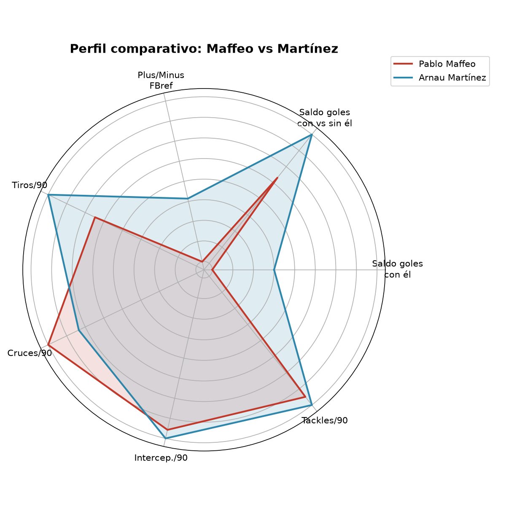

On/Off Impact: Maffeo vs Martínez

Comparativa de impacto ofensivo y defensivo de dos laterales derechos de LaLiga — Pablo Maffeo (Mallorca) y Arnau Martínez (Girona) — mediante métricas Plus/Minus y de volumen de juego, estandarizadas a 90 minutos.

Metodología
Fuente de datos: FBref (temporada 2025-26 de LaLiga, datos hasta la jornada 25).
Datos utilizados: minutos jugados, goles a favor/en contra del equipo con el jugador en el campo, goles totales de la temporada, puntos y partidos del equipo, tiros, cruces, intercepciones y tackles ganados.
Métricas calculadas:
GF/90, GC/90, Net/90: goles a favor, en contra y saldo neto del equipo por 90 minutos, mientras el jugador está en el campo.
On/Off Net: diferencia entre el rendimiento del equipo con el jugador en el campo y sin él, calculado por diferencia entre los totales de temporada y los datos "en campo".
Tiros/90, Cruces/90, Intercepciones/90, Tackles/90: totales de temporada estandarizados a 90 minutos para que la comparación sea justa pese a los distintos minutos jugados.
Puntos por partido del equipo: puntos totales ÷ partidos jugados.
Herramientas: Python (pandas para el cálculo, matplotlib para las visualizaciones), en un notebook Jupyter.
Resultados
Métrica	Pablo Maffeo	Arnau Martínez
Minutos jugados	2.662	2.666
Saldo goles con él (Net/90)	-0,14	-0,03
Saldo goles con vs. sin él (On/Off Net)	+0,58	+1,76
Plus/Minus FBref (90 min)	-0,14	-0,03
Tiros/90	0,24	0,64
Cruces/90	2,87	1,69
Intercepciones/90	1,12	1,25
Tackles/90	1,15	1,32
Puntos del equipo / partido	0,96	1,20

Interpretación del perfil comparativo
Aportación ofensiva
Generación de centros (Cruces/90): Maffeo destaca claramente sobre Martínez (2,87 vs. 1,69), un perfil de lateral centrado en ganar la banda y buscar el área mediante centros.
Llegada y remate (Tiros/90): Martínez supera con claridad a Maffeo en volumen de disparos (0,64 vs. 0,24), lo que sugiere mayor presencia en zonas interiores de remate o más incorporación al ataque por dentro.
Rendimiento defensivo
Entradas e intercepciones (Tackles/90 e Intercep./90): ambos laterales registran cifras altas de actividad defensiva, pero Martínez obtiene una ligera ventaja en las dos métricas (1,32 vs. 1,15 tackles; 1,25 vs. 1,12 intercepciones), mostrando algo más de efectividad en el corte y la recuperación de balón.
Impacto colectivo y métricas Plus/Minus
Efecto en el equipo (Saldo goles con vs. sin él): aquí está la diferencia más marcada del análisis. Ambos jugadores tienen un impacto positivo — su equipo rinde mejor con ellos en el campo que sin ellos — pero el de Martínez es notablemente mayor (+1,76 frente a +0,58 de Maffeo).
Saldo directo del marcador (Plus/Minus FBref y saldo de goles con él): en estas dos métricas ninguno de los dos está en positivo — el equipo encaja algo más de lo que marca mientras ambos juegan — pero Martínez se mantiene más cerca del equilibrio (-0,03 vs. -0,14 de Maffeo). Tiene sentido: mide el resultado bruto del partido, más condicionado por el rendimiento general del equipo que por el jugador en sí, y ninguno de los dos milita en un equipo dominante esta temporada.
Resumen del perfil comparativo
Pablo Maffeo: perfil tradicional de banda — más centrador que rematador, con una contribución defensiva sólida pero algo por debajo de Martínez en las métricas de recuperación.
Arnau Martínez: perfil más orientado a asociarse por dentro y llegar al remate, ligeramente superior en las métricas defensivas, y con el impacto colectivo (on/off) más determinante de los dos — aunque conviene leer esta última cifra con cautela: con un solo equipo de referencia y una muestra de temporada, puede estar influida por otros factores además del propio jugador (lesiones de compañeros, calendario, etc.).
Conclusión

Maffeo y Martínez representan dos formas distintas de entender el rol de lateral derecho: uno más centrado en el juego exterior y el centro al área, el otro más implicado en el juego interior y con mayor impacto agregado en el resultado de su equipo. Ninguna de las dos métricas de saldo directo (Net/90, Plus/Minus) es positiva para ninguno de los dos, reflejo de que ambos juegan en equipos de la zona media-baja de la tabla esta temporada — el On/Off es la métrica que mejor aísla su aportación individual del contexto colectivo, y en ese terreno Martínez se impone con claridad.

Limitaciones
Muestra de un solo jugador por equipo y una sola temporada: no permite generalizar conclusiones sobre el "mejor lateral de LaLiga".

El On/Off no controla por la calidad del rival ni por quién sustituye al jugador cuando no está en el campo.

Los datos de goles con/sin el jugador se derivan por diferencia respecto al total de temporada, no de un desglose partido a partido.

Autor

Ramos_data — proyecto de aprendizaje de Python y análisis de datos deportivos.
